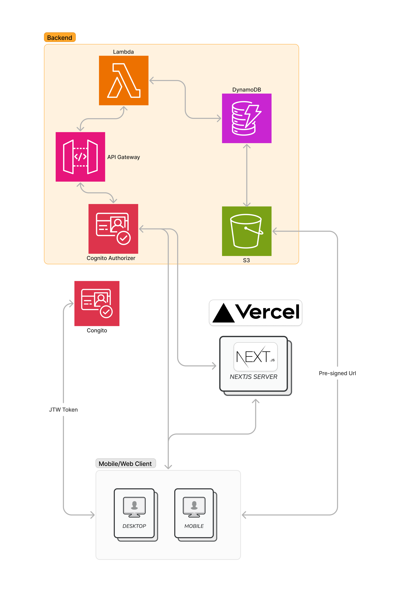

# About this repo

This repo contains the code for www.froodom.org.
It is a NextJS app that uses a python FastAPI to fetch data.

The frontend is hosted on Vercel and built with Typescript, TailwindCSS and NextUI and the backend is hosted on AWS and built with Python and FastAPI.

## Architecture Diagram

